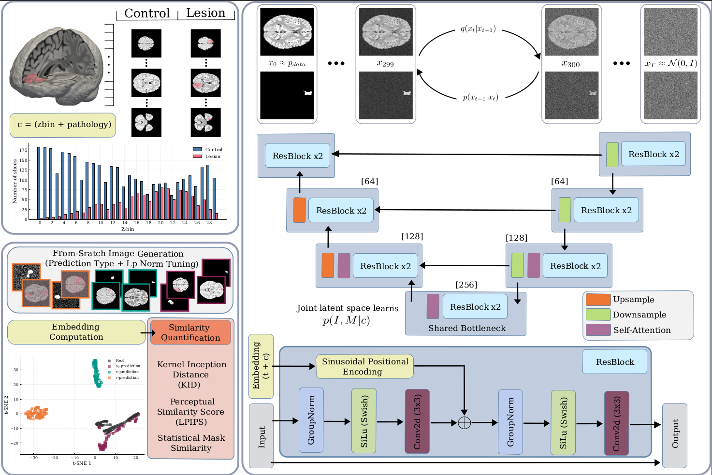
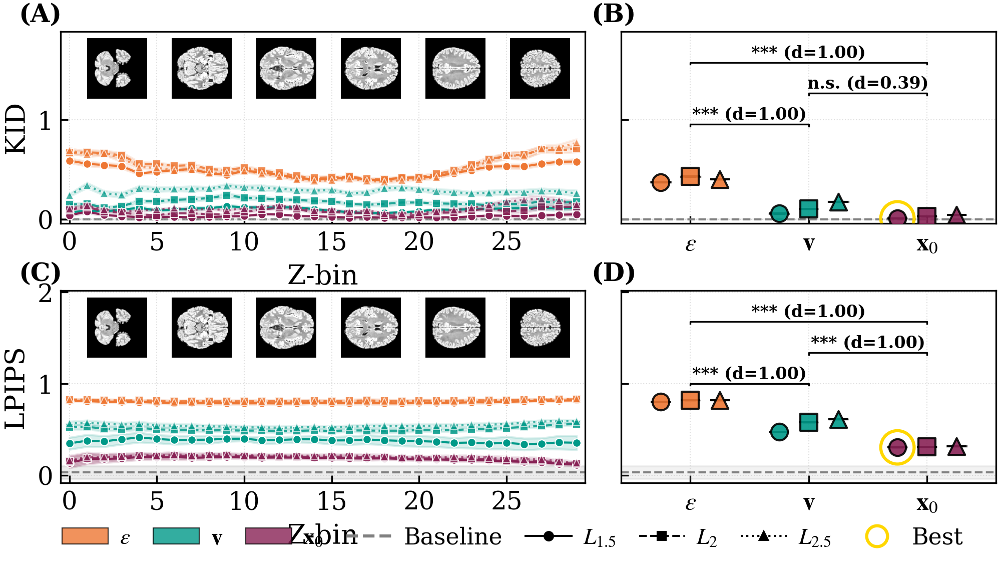
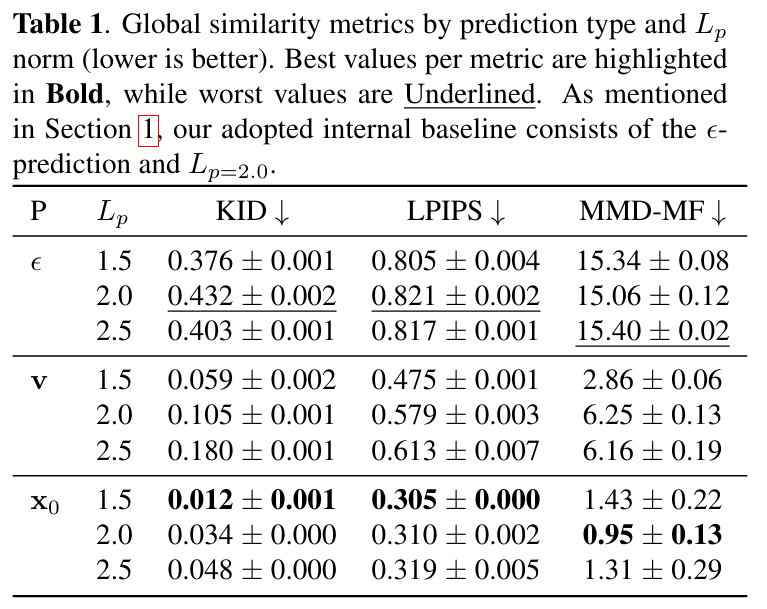

# SLIM-Diff: Shared Latent Image-Mask Diffusion

> [!WARNING]
> Models weights are to be released in Zenodo, along with a snapshot of the code, upon acceptance

<p align="center">
  <a href="https://arxiv.org/abs/2602.03372"></a>
  <a href="https://doi.org/10.5281/zenodo.18466774"></a>
  <a href="https://pypi.org/project/slim-diff/"></a>
  <a href="https://opensource.org/licenses/MIT"></a>
  <a href="https://www.python.org/downloads/"></a>
</p>

<p align="center">
  <b>A compact joint diffusion model for synthesizing paired FLAIR MRI slices and lesion masks in low-data epilepsy imaging scenarios.</b>
</p>

<p align="center">
  <a href="#installation">Installation</a> •
  <a href="#pretrained-models">Pretrained Models</a> •
  <a href="#quick-start">Quick Start</a> •
  <a href="#results">Results</a> •
  <a href="#citation">Citation</a>
</p>

---

## Authors

**Mario Pascual-González**<sup>1,2</sup>, **Ariadna Jiménez-Partinen**<sup>1,2,3</sup>, **R.M. Luque-Baena**<sup>1,2,3,*</sup>, **Fátima Nagib-Raya**<sup>4</sup>, **Ezequiel López-Rubio**<sup>1,2,3</sup>

<sup>1</sup> ITIS Software, University of Málaga, Spain
<sup>2</sup> Department of Computer Languages and Computer Science, University of Málaga, Spain
<sup>3</sup> IBIMA Plataforma BIONAND, Instituto de Investigación Biomédica de Málaga, Spain
<sup>4</sup> Department of Radiology, Hospital Regional Universitario de Málaga, Spain
<sup>*</sup> Corresponding author: [rmluque@uma.es](mailto:rmluque@uma.es)

---



## Abstract

Focal Cortical Dysplasia (FCD) is a leading cause of drug-resistant epilepsy, yet automatic detection remains challenging due to subtle MRI features and extremely limited labeled data. We present **SLIM-Diff**, a compact joint diffusion model that simultaneously synthesizes paired FLAIR images and lesion masks through a shared-bottleneck U-Net architecture.

### Key Findings

- **x₀-prediction parameterization** yields **37× better mask quality** than ε-prediction (measured by MMD on morphological features)
- **Tunable Lₚ loss geometry** (p=2.25) provides optimal trade-off between image fidelity and mask accuracy
- **Self-conditioning** significantly improves sample quality across all metrics
- The model successfully generates anatomically plausible lesion masks with realistic morphology

### Key Features

- **Single shared-bottleneck U-Net** for joint image+mask synthesis
- **x₀-prediction parameterization** (37× better mask quality than ε-prediction)
- **Tunable Lₚ loss geometry** for image/mask fidelity trade-offs
- **Z-position and pathology class conditioning** for controllable generation
- **Self-conditioning** for improved sample quality
- **Anatomical prior conditioning** via cross-attention for spatial guidance
- **Focal Frequency Loss (FFL)** for improved edge sharpness

---

## Installation

```bash
pip install slim-diff
```

For development:

```bash
git clone https://github.com/MarioPasc/slim-diff.git
cd slim-diff
pip install -e ".[dev]"
```

---

## Pretrained Models

We provide pretrained weights for all model configurations evaluated in our paper. Models are hosted on Zenodo with a permanent DOI for reproducibility.

### Recommended Model

| Model | Prediction | Lₚ | Description | Download |
|-------|------------|-----|-------------|----------|
| **slimdiff_x0_lp1.5.ckpt** | $x_0$ | 1.5  | Best overall (paper default) | [Download](https://doi.org/10.5281/zenodo.18466774) |


### Quick Start with Pretrained Model

```bash
# 1. Download the recommended model
# 2. Generate samples
slimdiff-generate \
    --ckpt slimdiff_x0_lp1.5.pt \
    --config configs/examples/training_example.yaml \
    --out_dir outputs/generated_samples/
```

---

## Quick Start

SLIM-Diff provides four main CLI commands for the complete synthesis pipeline:

### 1. Prepare Slice Cache

Convert 3D MRI volumes into 2D slice cache for efficient training:

```bash
slimdiff-cache --config configs/examples/cache_example.yaml
```

### 2. Train Model

Train the joint diffusion model:

```bash
slimdiff-train --config configs/examples/training_example.yaml
```

### 3. Generate Samples

Generate synthetic image-mask pairs using one of two methods:

**Command-line arguments:**
```bash
slimdiff-generate --config config.yaml --ckpt model.ckpt --out_dir output/
```

**JSON specification (recommended for reproducible experiments):**
```bash
slimdiff-generate-spec --spec generation_spec.json
```

The JSON specification supports two formats:

<details>
<summary>Detailed format - explicit per-zbin specification</summary>

```json
{
    "checkpoint_path": "/path/to/model.ckpt",
    "config_path": "src/diffusion/config/jsddpm.yaml",
    "output_dir": "./outputs/generation_run_001",
    "seed": 42,
    "device": "cuda",
    "format": "detailed",
    "samples": [
        {"zbin": 0, "control": 10, "lesion": 5},
        {"zbin": 5, "control": 20, "lesion": 10},
        {"zbin": 10, "control": 15, "lesion": 15}
    ]
}
```
</details>

<details>
<summary>Compact format - defaults with optional overrides</summary>

```json
{
    "checkpoint_path": "/path/to/model.ckpt",
    "config_path": "src/diffusion/config/jsddpm.yaml",
    "output_dir": "./outputs/generation_run_002",
    "seed": 123,
    "device": "cuda",
    "format": "compact",
    "defaults": {
        "control": 10,
        "lesion": 10,
        "zbins": "all"
    },
    "overrides": [
        {"zbin": 0, "control": 5, "lesion": 2},
        {"zbin": 29, "control": 5, "lesion": 2}
    ]
}
```
</details>

Additional generation options:
```bash
# Validate specification without generating
slimdiff-generate-spec --spec spec.json --validate-only

# Dry run (show plan)
slimdiff-generate-spec --spec spec.json --dry-run

# Verbose output
slimdiff-generate-spec --spec spec.json --verbose
```

### 4. Compute Similarity Metrics

Evaluate generated samples against real data:

```bash
# Image quality metrics (KID, FID, LPIPS)
slimdiff-metrics image-metrics --config metrics_config.yaml

# Mask morphology metrics (MMD-MF)
slimdiff-metrics mask-metrics --config metrics_config.yaml

# Generate publication-ready plots
slimdiff-metrics plot --config metrics_config.yaml
```

---

## Results

### Similarity Metrics Comparison



### Quantitative Results



---

## Configuration

Example configuration files are provided in `configs/examples/`:

- `cache_example.yaml` - Slice cache setup
- `training_example.yaml` - Model training
- `generation_spec_example.json` - JSON generation specification
- `metrics_example.yaml` - Similarity metrics computation

See the [configuration documentation](configs/examples/) for detailed parameter descriptions.

---

## Model Architecture

SLIM-Diff uses a shared-bottleneck U-Net architecture that processes both the FLAIR image and lesion mask jointly:

```
Input: [image, mask] (2 channels)
  │
  ▼
Encoder (shared) ──► Bottleneck (shared) ──► Decoder (shared)
  │                                              │
  ├── Z-position embedding                       │
  ├── Pathology class embedding                  │
  └── Anatomical prior (cross-attention)         │
                                                 ▼
                                    Output: [image, mask] (2 channels)
```

**Key architectural choices:**
- **Prediction type**: x₀-prediction (directly predicts clean sample)
- **Loss function**: Lₚ norm (p=2.25) + Focal Frequency Loss
- **Conditioning**: Class embeddings + optional anatomical cross-attention
- **Self-conditioning**: 50% probability during training

---

## Citation

If you use SLIM-Diff in your research, please cite our paper:

<!-- arXiv preprint (update when published) -->
```bibtex
@misc{pascualgonzález2026slimdiffsharedlatentimagemask,
      title={SLIM-Diff: Shared Latent Image-Mask Diffusion with Lp loss for Data-Scarce Epilepsy FLAIR MRI}, 
      author={Mario Pascual-González and Ariadna Jiménez-Partinen and R. M. Luque-Baena and Fátima Nagib-Raya and Ezequiel López-Rubio},
      year={2026},
      eprint={2602.03372},
      archivePrefix={arXiv},
      primaryClass={cs.CV},
      url={https://arxiv.org/abs/2602.03372}, 
}
```

<!--
Accepted at ICIP 2026 - Uncomment and use this citation after acceptance:

```bibtex
@misc{pascualgonzález2026slimdiffsharedlatentimagemask,
      title={SLIM-Diff: Shared Latent Image-Mask Diffusion with Lp loss for Data-Scarce Epilepsy FLAIR MRI}, 
      author={Mario Pascual-González and Ariadna Jiménez-Partinen and R. M. Luque-Baena and Fátima Nagib-Raya and Ezequiel López-Rubio},
      year={2026},
      eprint={2602.03372},
      archivePrefix={arXiv},
      primaryClass={cs.CV},
      url={https://arxiv.org/abs/2602.03372}, 
}
```
-->

---

## License

This project is licensed under the MIT License - see the [LICENSE](LICENSE) file for details.

---

## Acknowledgments

This work is partially supported by:

- **Autonomous Government of Andalusia** (Spain) under project UMA20-FEDERJA-108
- **Ministry of Science and Innovation of Spain**, grant number PID2022-136764OA-I00
- **European Regional Development Fund** (ERDF)
- **Fundación Unicaja** under project PUNI-003_2023
- **IBIMA Plataforma BIONAND** under project ATECH-25-02
- **Instituto de Salud Carlos III**, project code PI25/02129 (co-financed by the European Union)

The authors thankfully acknowledge the computer resources, technical expertise and assistance provided by the **SCBI (Supercomputing and Bioinformatics) center** of the University of Málaga.
